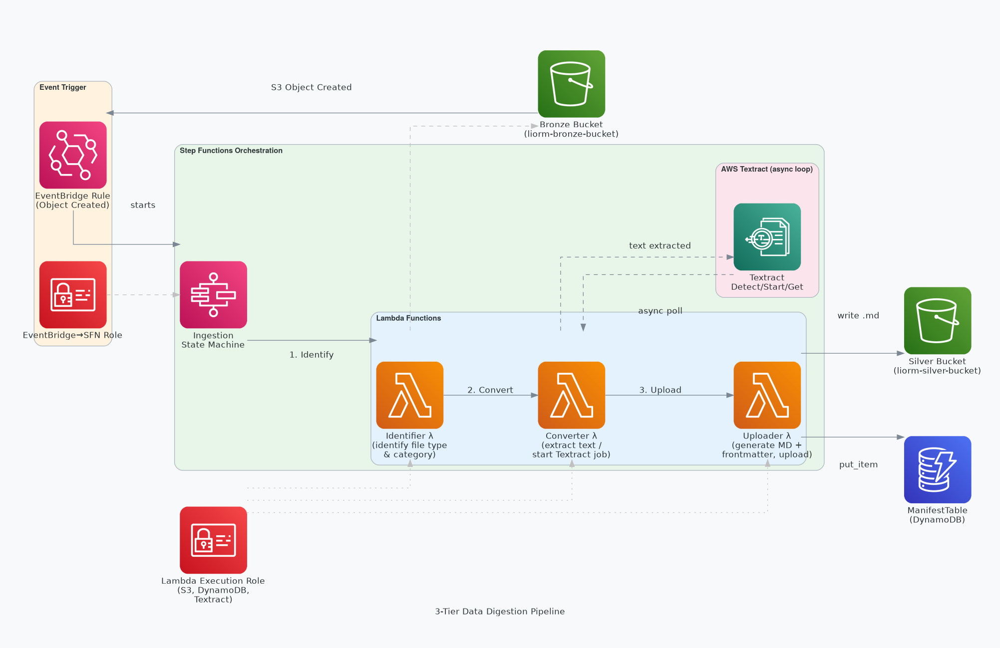

# 3-Tier Data Digestion Pipeline

A serverless, event-driven ingestion pipeline that automatically picks up files dropped into S3, extracts their text content (including PDFs and images via AWS Textract), and promotes clean, structured Markdown documents to a curated Silver bucket — complete with YAML frontmatter and a DynamoDB manifest entry.

---

## Architecture Overview



---

## How It Works

### 1. Event Trigger
When any object is created in the **Bronze bucket** (`liorm-bronze-bucket`), an **EventBridge rule** fires and launches the Step Functions state machine. No polling, no cron — fully reactive.

### 2. Orchestration — Step Functions State Machine

The pipeline is a four-state machine named `3-tier-data-digestion-pipeline`:

```
Identify → ConvertOrStartAsync → CheckComplexStatus ──► UploadAndManifest
                   ▲                      │
                   │    (IN_PROGRESS)      │
                   └──── WaitForTextract ◄─┘
```

| State | Description |
|---|---|
| **Identify** | Reads S3 tags and file extension; classifies the object |
| **ConvertOrStartAsync** | Extracts text (plain files) or submits an async Textract job |
| **CheckComplexStatus** | Routes on `JobStatus`: SUCCEEDED → upload, IN_PROGRESS → wait |
| **WaitForTextract** | Pauses 5 seconds, then loops back to poll Textract |
| **UploadAndManifest** | Writes the final `.md` file to Silver and records it in DynamoDB |

---

## Components

### Lambda Functions

| Function | Runtime | Timeout | Purpose |
|---|---|---|---|
| `3-tier-data-digestion-identifier` | Python 3.12 / arm64 | 30 s | Reads EventBridge event, fetches S3 object tags, determines file type and complexity |
| `3-tier-data-digestion-converter` | Python 3.12 / arm64 | 60 s | Extracts text from plain files directly; for complex files (PDF, DOCX, PNG, JPG), starts an async Textract job and polls until complete |
| `3-tier-data-digestion-uploader` | Python 3.12 / arm64 | 30 s | Generates YAML frontmatter, assembles the final Markdown document, uploads to the Silver bucket, and writes a manifest record to DynamoDB |

### Storage

| Resource | Type | Purpose |
|---|---|---|
| `liorm-bronze-bucket` | S3 | Landing zone for raw files (pre-existing) |
| `liorm-silver-bucket` | S3 | Curated output — structured `.md` files (pre-existing) |
| `3-tier-data-digestion-manifest` | DynamoDB (PAY_PER_REQUEST) | Searchable index of all processed files with title, path, and location |

### IAM Roles

| Role | Used By | Key Permissions |
|---|---|---|
| `LambdaExecutionRole` | All three Lambdas | S3 read/write (bronze + silver), DynamoDB `PutItem`, Textract sync + async |
| `EventBridgeToStepFunctionRole` | EventBridge rule | `states:StartExecution` on the state machine |
| `StateMachineRole` | Step Functions | `lambda:InvokeFunction` on all three Lambdas |

---

## File Categories & Output Structure

Files are categorised using the **S3 object tag** `Category` (set at upload time). The Uploader Lambda maps this to an output path in the Silver bucket:

```
Silver Bucket
└── {Category}/
    └── {original-filename}.md
```

**Example:** a file tagged `Category=Legal` named `contract.pdf` becomes:
```
s3://liorm-silver-bucket/Legal/contract.md
```

If no tag is present, the file is placed under `Unsorted/`.

---

## Output Format — Markdown with YAML Frontmatter

Every processed file is stored as a `.md` document with auto-generated frontmatter:

```markdown
---
title: "First line of the document (up to 100 chars)"
audience: [developer, customer]
topic: [legal]
last_updated: 2025-06-01
status: verified
---

<extracted text content>
```

---

## Supported File Types

| Type | Processing Method |
|---|---|
| `.txt`, `.csv`, and other plain text | Direct S3 `get_object` read |
| `.pdf`, `.docx`, `.png`, `.jpg` | Async AWS Textract (`StartDocumentTextDetection`) |

---

## DynamoDB Manifest Schema

| Attribute | Type | Example |
|---|---|---|
| `filename` (PK) | String | `Legal/contract.md` |
| `description` | String | `Markdown document: Service Agreement 2025` |
| `location` | String | `s3://liorm-silver-bucket/Legal/contract.md` |

---

## Deployment

This stack is deployed via AWS CloudFormation. All resources are tagged with:

```
Name:  3-tier-data-digestion
User:  liorm-at-polus
```

**Deploy:**
```bash
aws cloudformation deploy \
  --template-file template.yaml \
  --stack-name 3-tier-data-digestion \
  --capabilities CAPABILITY_IAM
```

**Tear down:**
```bash
aws cloudformation delete-stack --stack-name 3-tier-data-digestion
```

> **Note:** The Bronze and Silver S3 buckets are **pre-existing** and are not created or deleted by this stack.

---

## Prerequisites

- Bronze bucket (`liorm-bronze-bucket`) must have **EventBridge notifications enabled**.
- Objects uploaded to the Bronze bucket should carry an S3 tag: `Category=<value>` (e.g. `Legal`, `Finance`, `HR`).
- The deploying IAM principal needs permissions to create Lambda, Step Functions, DynamoDB, IAM, and EventBridge resources.

---

## Notes & Limitations

- Textract polling uses a 5-second `Wait` state loop. For very large documents, execution time will scale accordingly.
- Textract pagination (`NextToken`) is not currently implemented — extremely large documents may have truncated output.
- Plain text files are decoded as UTF-8; binary formats not listed above are not supported.
