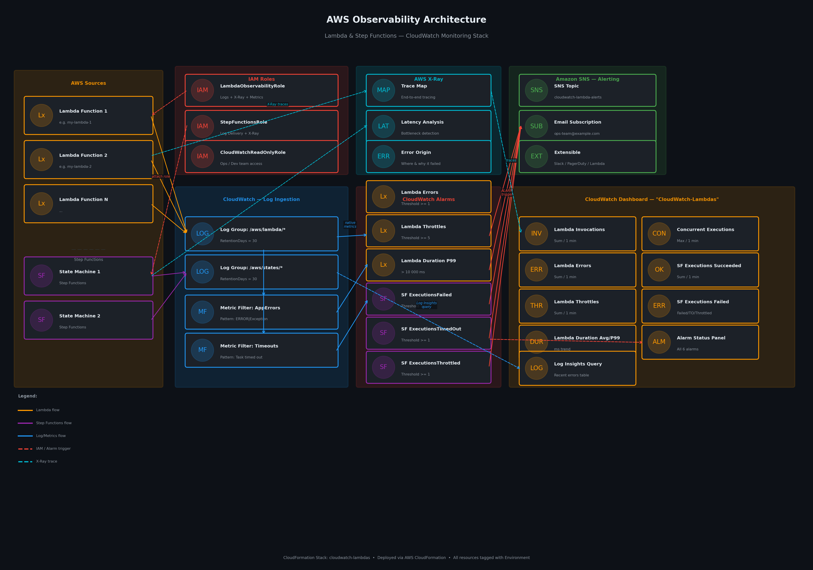

# CloudWatch Lambdas — Observability & Alerting Stack

> Centralized monitoring, alerting, and observability for AWS Lambda functions and Step Functions using CloudWatch, X-Ray, and SNS.

---

## Architecture



---

## What's Deployed

### IAM Roles (3)

| Role | Purpose |
|---|---|
| `LambdaObservabilityRole` | Assign to your Lambda functions. Grants CloudWatch Logs, X-Ray, and custom metrics **write** access. |
| `StepFunctionsObservabilityRole` | Assign to your State Machines. Grants log delivery and X-Ray tracing permissions. |
| `CloudWatchReadOnlyRole` | For ops/dev team members to **view** dashboards and alarms without write access. |

---

### CloudWatch Alarms (6)

**Lambda**
- `Lambda-Errors` — triggers when error count ≥ threshold (default: 1)
- `Lambda-Throttles` — triggers when throttle count ≥ threshold (default: 5)
- `Lambda-HighDuration` — triggers when P99 duration exceeds 10,000 ms

**Step Functions**
- `StepFunctions-ExecutionsFailed` — triggers on any failed execution
- `StepFunctions-ExecutionsTimedOut` — triggers on any timed-out execution
- `StepFunctions-ExecutionsThrottled` — triggers on any throttled execution

---

### Other Resources

- **SNS Topic** — `cloudwatch-lambda-alerts-{env}` with an email subscription for all alarm notifications. Extensible to Slack, PagerDuty, or a Lambda for custom routing.
- **Log Groups (2)** — `/aws/lambda/observability-{env}` and `/aws/states/observability-{env}` with configurable retention (default: 30 days).
- **Metric Filters (2)** — scan logs for `ERROR|Exception|exception` patterns and `Task timed out` strings, publishing custom metrics to `Custom/Lambda/{env}`.
- **CloudWatch Dashboard** — `CloudWatch-Lambdas-{env}` with panels for:
  - Lambda: Invocations, Errors, Throttles, Duration (Avg + P99), Concurrent Executions
  - Step Functions: Started, Succeeded, Failed/TimedOut/Throttled, Execution Duration
  - Alarm status widget for at-a-glance health
  - Live Log Insights query panel showing the last 50 errors

---

## Prerequisites

- [AWS CLI](https://aws.amazon.com/cli/) installed and configured
- IAM permissions to create CloudFormation stacks, IAM roles, CloudWatch resources, and SNS topics
- An AWS account and target region

---

## Parameters

| Parameter | Description | Default |
|---|---|---|
| `AlertEmail` | Email to receive alarm notifications | `ops-team@example.com` |
| `LambdaFunctionNames` | Comma-separated Lambda function names | `my-lambda-1,my-lambda-2` |
| `StepFunctionArns` | Comma-separated State Machine ARNs | *(example ARN)* |
| `ErrorAlarmThreshold` | Lambda error count to trigger alarm | `1` |
| `ThrottleAlarmThreshold` | Lambda throttle count to trigger alarm | `5` |
| `LogRetentionDays` | Days to retain CloudWatch logs | `30` |
| `Environment` | Deployment environment tag | `production` |

---

## Deploy

```bash
aws cloudformation deploy \
  --template-file cloudwatch-lambdas.yaml \
  --stack-name cloudwatch-lambdas \
  --parameter-overrides \
      AlertEmail=your@email.com \
      Environment=production \
      LambdaFunctionNames=my-lambda-1,my-lambda-2 \
      ErrorAlarmThreshold=1 \
      ThrottleAlarmThreshold=5 \
      LogRetentionDays=30 \
  --capabilities CAPABILITY_NAMED_IAM \
  --region us-east-1
```

> After deploying, check your email inbox and **confirm the SNS subscription** to start receiving alarm notifications.

---

## After Deploying — Attach Roles

Once the stack is deployed, retrieve the role ARNs from the stack outputs and attach them to your existing resources.

### Get stack outputs
```bash
aws cloudformation describe-stacks \
  --stack-name cloudwatch-lambdas \
  --query "Stacks[0].Outputs" \
  --output table \
  --region us-east-1
```

### Attach role to a Lambda function
```bash
aws lambda update-function-configuration \
  --function-name YOUR_LAMBDA_NAME \
  --role $(aws cloudformation describe-stacks \
    --stack-name cloudwatch-lambdas \
    --query "Stacks[0].Outputs[?OutputKey=='LambdaObservabilityRoleArn'].OutputValue" \
    --output text \
    --region us-east-1) \
  --region us-east-1
```

### Enable X-Ray tracing on a Lambda function
```bash
aws lambda update-function-configuration \
  --function-name YOUR_LAMBDA_NAME \
  --tracing-config Mode=Active \
  --region us-east-1
```

### Enable X-Ray tracing on a Step Function
```bash
aws stepfunctions update-state-machine \
  --state-machine-arn YOUR_STATE_MACHINE_ARN \
  --tracing-configuration enabled=true \
  --region us-east-1
```

---

## View the Dashboard

```bash
# Print the dashboard URL directly
aws cloudformation describe-stacks \
  --stack-name cloudwatch-lambdas \
  --query "Stacks[0].Outputs[?OutputKey=='DashboardUrl'].OutputValue" \
  --output text \
  --region us-east-1
```

Or open the AWS Console and navigate to:
**CloudWatch → Dashboards → CloudWatch-Lambdas-production**

---

## Destroy

> ⚠️ This will permanently delete all alarms, log groups, metric filters, the dashboard, IAM roles, and the SNS topic. Log data will be lost if not exported first.

```bash
aws cloudformation delete-stack \
  --stack-name cloudwatch-lambdas \
  --region us-east-1

# Wait for deletion to complete
aws cloudformation wait stack-delete-complete \
  --stack-name cloudwatch-lambdas \
  --region us-east-1

echo "Stack deleted successfully."
```

### Verify deletion
```bash
aws cloudformation describe-stacks \
  --stack-name cloudwatch-lambdas \
  --region us-east-1 2>&1 | grep -c "does not exist" \
  && echo "Confirmed: stack no longer exists."
```

---

## Stack Outputs

| Output Key | Description |
|---|---|
| `DashboardUrl` | Direct URL to the CloudWatch Dashboard |
| `AlertingSnsTopicArn` | ARN of the SNS alerting topic |
| `LambdaObservabilityRoleArn` | Role ARN to attach to Lambda functions |
| `StepFunctionsObservabilityRoleArn` | Role ARN to attach to State Machines |
| `LambdaLogGroupName` | CloudWatch Log Group name for Lambdas |
| `StepFunctionsLogGroupName` | CloudWatch Log Group name for Step Functions |

---

## Cost Estimate

All resources in this stack fall within the **AWS Free Tier** for most workloads:

| Resource | Free Tier | Cost After |
|---|---|---|
| CloudWatch Alarms (6) | 10 free/month | $0.10/alarm/month |
| CloudWatch Dashboard (1) | 3 free/month | $3/dashboard/month |
| Custom Metrics (2) | 10 free/month | ~$0.30/metric/month |
| SNS Notifications | 1M free/month | $0.50/million |
| Log Ingestion | First 5 GB free | $0.50/GB after |
| Log Storage | First 5 GB free | $0.03/GB/month |

**Estimated monthly cost for most teams: $0 – $5/month.**

---

## Files

```
.
├── README.md                              # This file
├── cloudwatch-lambdas.yaml                # CloudFormation template
└── cloudwatch-lambdas-architecture.png   # Architecture diagram
```

---

*Managed by AWS CloudFormation. All resources are tagged with `Environment` and `ManagedBy: CloudFormation`.*
